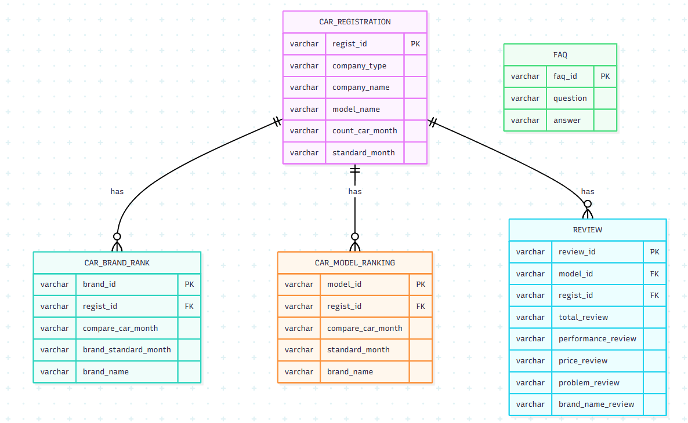

# 🚗 Auto Insight — 자동차 등록 현황 통합 시스템

국내 월별 자동차 신규 등록 데이터를 수집·적재하고, 브랜드/모델별 랭킹과 실사용자 리뷰를 한눈에 볼 수 있는 Streamlit 대시보드입니다.

> SKN35_1st_Project_Group5

## ✨ 주요 기능

| 메뉴 | 설명 |
| --- | --- |
| 🏠 Home | 전체 등록대수·제조사 수 요약, 월별 등록 추이 그래프, 리뷰 키워드 검색 |
| 📋 자동차 등록 현황 | 월별 등록 데이터 조회, 행 클릭 시 모델별 등록 추이 팝업 |
| 🏆 브랜드별 랭킹 | 연/월/국산·수입 구분 필터, 전월 대비 증감 표시 |
| 🚘 모델별 랭킹 | 등록대수 기준 모델 순위, 모델별 실사용자 리뷰(평점/성능/가격/문제점) 보기 |
| ❓ FAQ | 자주 묻는 질문 아코디언, 1:1 문의 링크 |

## 🛠️ 기술 스택

- **Frontend/App**: Streamlit, streamlit-option-menu, Plotly
- **Data**: pandas, SQLAlchemy, PyMySQL
- **DB**: TiDB Cloud (MySQL 호환)
- **크롤링**: Selenium, webdriver-manager
- **패키지 관리**: [uv](https://docs.astral.sh/uv/)

## 📁 프로젝트 구조

```text
SKN35-1st-5Team/
├── app.py                        # 진입점: 페이지 설정, 사이드바 라우팅
├── db.py                         # SQLAlchemy 엔진 및 DB 초기화
├── data_loader.py                # 화면별 데이터 로드 (st.cache_data)
├── dialogs.py                    # 상세 추이 / 리뷰 팝업(dialog) 모음
├── constants.py                  # 브랜드 로고 · 차량 이미지 매핑
├── config/
│   ├── dataclasses.py            # 앱 메타 설정(AppConfig)
│   └── enums.py                  # 사이드바 메뉴 정의
├── styles/
│   └── styles.py                 # 전역 커스텀 CSS, 사이드바 메뉴 스타일
├── sql/
│   ├── select_tables.py          # 조회 쿼리 모음
│   └── test_qna_table.py         # 테이블 생성 DDL, FAQ 초기 데이터
├── views/
│   ├── home.py                   # 홈 화면
│   ├── registration.py           # 자동차 등록 현황
│   ├── brand_ranking.py          # 브랜드별 랭킹
│   ├── model_ranking.py          # 모델별 랭킹
│   └── faq.py                    # FAQ
├── clower/                       # Selenium 크롤링 스크립트
│   ├── clower_carisyou.py        # carisyou.com → 월별 등록 현황 수집
│   └── clower_review_encar.py    # encar.com → 실사용자 리뷰 수집
└── image/                        # 로고 · ERD 등 문서/에셋 이미지
    ├── athiscar.png
    └── erd.png
```

## 🗄️ ERD



## 🚀 시작하기

### 1. 요구 사항

- Python 3.12 이상
- [uv](https://docs.astral.sh/uv/getting-started/installation/)
- MySQL 호환 DB (TiDB Cloud 등) 접속 정보

### 2. 설치

```bash
git clone https://github.com/SKNETWORKS-FAMILY-AICAMP/SKN35-1st-5Team.git
cd SKN35-1st-5Team
uv sync
```

### 3. 환경 변수 설정

프로젝트 루트에 `.env` 파일을 생성하고 아래 값을 채워주세요.

```env
DB_USERNAME=your_db_username
DB_PASSWORD=your_db_password
DB_HOST=your_db_host
DB_PORT=4000
DB_DATABASE=cars_db

# TiDB Cloud 등 SSL이 필요한 경우 (host가 tidbcloud.com이면 자동 활성화)
# DB_SSL_ENABLED=true
```

### 4. DB 테이블 초기화 (최초 1회)

```bash
uv run python db.py
```

### 5. 앱 실행

```bash
uv run streamlit run app.py
```

브라우저에서 `http://localhost:8501` 로 접속합니다.

## 📊 데이터 파이프라인

1. `clower/` 스크립트가 carisyou.com(등록 현황), encar.com(리뷰) 데이터를 크롤링
2. `db.py` / `sql/`을 통해 TiDB에 적재
3. `data_loader.py`가 `@st.cache_data`로 조회 결과를 캐싱해 각 화면에 전달
4. `views/` 각 화면이 필터링·페이지네이션 후 표 및 카드 UI로 렌더링

## 👥 팀

SKN35 1기 5조 (SKNETWORKS-FAMILY-AICAMP)
